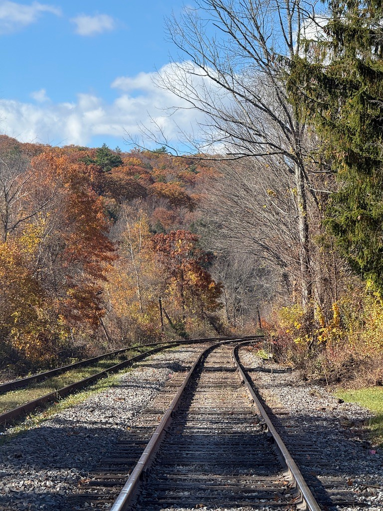

# autumn-line

A cel-shaded, cartoon-style 3D recreation of an autumn railway scene, built with [Three.js](https://threejs.org/) and Vite.

## Prompt

The scene was generated from a single reference photo with this prompt:

> create a highly detailed 3D scenery that faithfully captures this photo in a cel-shaded cartoon art style

**API usage cost:** $38

## Reference image



## Running locally

```bash
npm install
npm run dev
```

Other scripts: `npm run build`, `npm run preview`, `npm run typecheck`.
